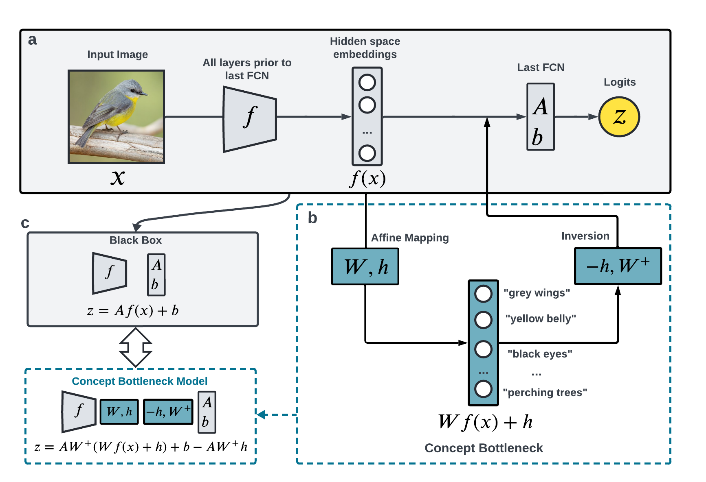

# CBM-zero
Codes for reproducing results in the paper ``CBM-zero: Concept Bottleneck Model with Zero Performance Loss''

## Black-box models
Please check `saved_black_box_models/`. These models use a fixed CLIP-ViT-L/14 image encoder as its backbone and fine tune a two-layer MLP. Only the MLP are included. If you want to explain your own model: (1) save the weight and bias of the last FCN of your own model in `saved_bb_last_FCN/`; (2) save the image embeddings in the hidden space just prior to the last FCN in `saved_bb_features/`

## Concept Bank
The source of concept bank varies per dataset

* CIFAR-10, CIFAR-100, and ImageNet: Concept bank are curated by querying ConceptNet with {class name} and find concepts connected to it.
* CUB and AwA2: Concept bank is the annotations
* Food-101: Concept bank curated by Labo are used (with filtering of too long concepts).

Please check the concept names in `/asset/concept_bank`. If you want to use your own concept bank, please edit `/asset/concept_bank`.

## Run the code
- CIFAR-10

`python learn_cbm.py --data_name cifar10 --concept_set_source cifar10_conceptnet --black_box_model_name clip_mlp_ViT-L_14-h64_cifar10`
- CIFAR-100

`python learn_cbm.py --data_name cifar100 --concept_set_source cifar100_conceptnet --black_box_model_name clip_mlp_ViT-L_14-h256_cifar100`
- ImageNet

`python learn_cbm.py --data_name imagenet --concept_set_source imagenet_conceptnet --black_box_model_name clip_mlp_ViT-L_14_imagenet`
- CUB

`python learn_cbm.py --data_name cub --concept_set_source cub_annotations --black_box_model_name clip_mlp_ViT-L_14-h256_cub`
- AwA2

`python learn_cbm.py --data_name awa2 --concept_set_source awa2_annotations --black_box_model_name clip_mlp_ViT-L_14-h64_awa2`
- Food-101

`python learn_cbm.py --data_name food101 --concept_set_source food101_labo --black_box_model_name clip_mlp_ViT-L_14-h256_food101`