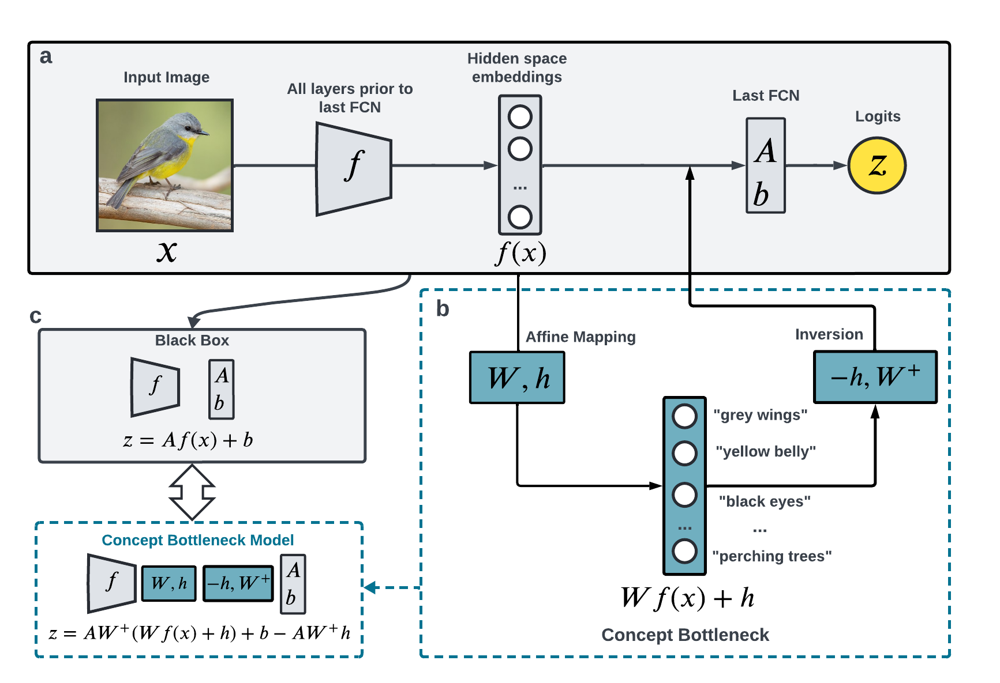

# CBM-zero
### Codes for reproducing results in paper entitled *"Concept Bottleneck Model with Zero Performance Loss"*



## Dataset notes
Decide on folders to host the data, and save the paths in a file named `data_path.py` (note: this file is not included in this repository). An example content for `data_path.py` is as follows:


    import os
    data_path_cifar10 = os.path.expanduser("~/.cache")
    data_path_cifar100 = os.path.expanduser("~/.cache")
    data_path_imagenet = '/data/imagenet/'
    data_path_food101 = '/data/food101/'
    data_path_cub = '/data/cub/'
    data_path_awa2 = '/data/awa2/'

* **CIFAR-10** and **CIFAR-100**: the data will be downloaded automatically.
* **ImageNet**: download the data from [ImageNet](https://image-net.org/challenges/LSVRC/2012/2012-downloads.php) and place `ILSVRC2012_devkit_t12.tar.gz`, `ILSVRC2012_img_train.tar`, and `ILSVRC2012_img_val.tar` in corresponding folder.
* **CUB-200-2011**: Download images and concept annotations from [Kaggle](https://www.kaggle.com/datasets/wenewone/cub2002011)
* **AwA2**: Download images from [AwA2](https://cvml.ista.ac.at/AwA2/)
* **Food-101**: the data will be automatically downloaded.

## Black-box models
Please check `saved_black_box_models/`. These models use a fixed CLIP-ViT-L/14 image encoder as its backbone and fine-tune a two-layer MLP. Only the MLP is included. If you want to explain your own model:
1. Save the weight and bias of the last FCN of your own model in `saved_bb_last_FCN/`.
2. Save the image embeddings in the hidden space just prior to the last FCN in `saved_bb_features/`.

## Concept Bank
The source of the concept bank varies per dataset:

* CIFAR-10, CIFAR-100, and ImageNet: Concept banks are curated by querying ConceptNet with {class name} and finding concepts connected to it. Check `concept_collection/conceptnet` for codes.
* CUB and AwA2: Concept banks are the annotations.
* Food-101: Concept banks curated by Labo are used (with filtering of too long concepts). GPT-4 is used to establish valid concepts for each class. Check `concept_collection/gpt` for codes.

Please check the concept names in `/asset/concept_bank`. If you want to use your own concept bank, please edit `/asset/concept_bank`.

## Run the code
- **Construct CBM-zero**
    ```
    python train.py --data_name <data_name> --concept_set_source <concept_set_source> --black_box_model_name <black_box_model_name> --pc_threshold <pc_threshold>
    ```
    1. fitted model is saved in `checkpoints`
    2. hyperparameter search is automatically conducted by running this code, the illustration of process is saved in `results/lambda`
- **Test the saved CBM-zero model**
    ```
    python test.py --data_name <data_name> --concept_set_source <concept_set_source> --black_box_model_name <black_box_model_name>
    ```

- **Global explantions (plot examples)**
    ```
    python explanation_global.py --data_name <data_name> --concept_set_source <concept_set_source> --black_box_model_name <black_box_model_name> --class_name <class_name>
    ```
    Images saved in `explanations/global/<data_name>`
- **Local explantions (plot examples)**
    ```
    python explanation_local.py --data_name <data_name> --concept_set_source <concept_set_source> --black_box_model_name <black_box_model_name> --class_name <class_name>
    ```
    Images saved in `explanations/lobal/<data_name>`

|data_name|concept_set_source|black_box_model_name|pc_threshold|
|--|--|--|--|
|cifar10|cifar10_conceptnet|clip_mlp_ViT-L_14-h64_cifar10|0.8|
|cifar100|cifar100_conceptnet|clip_mlp_ViT-L_14-h256_cifar100|0.8|
|imagenet|imagenet_conceptnet|clip_lp_ViT-L_14_imagenet|0.8|
|cub|cub_annotations|clip_mlp_ViT-L_14-h256_cub|0|
|awa2|awa2_annotations|clip_mlp_ViT-L_14-h64_cub|0|
|food101|food101_labo|clip_mlp_ViT-L_14-h256_food101|0.8|

**Tunable hyperparameters**
* -- `power` the power of exponential transformation controlling how much you want to emphasize on high clip scores, default = 5
* -- `alpha` the trade-off between L1 and L2 regularization, default = 0.5
* -- `n_iter` the number of iteration, default = 5000
* -- `lr` initial learning rate, default = 0.1
* -- `pc_threshold` threshold to filter out undetecable concept, default is 0 (no filtering).
* -- `clip_model_name` clip model name, default is 'ViT-L_14'. Other choices: 'ViT-B_32',  'ViT-B_16',  'RN50', 'RN100' 